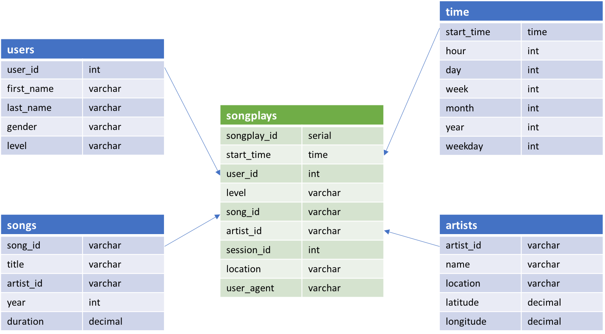

## Project Overview

This project is an excercise for building data lake using spark and AWS S3. Fact and dimension tables for a star schema is defined. The ETL pipeline is written to first load data from AWS S3, then execute spark/SQL codes to create analytics tables. The tables are then saved in another S3 bucket.

The dataset is a simulated dataset of a spotify-like startup. It includes songplay logs, song details and artist details. The output data is modeled using a star scheme, with 1 fact table "songplays" and 4 dimension tables "users", "songs", "artists" and "time".

## How to Run:
- fill out AWS keys in dl.cfg 
- specify output S3 bucket
- run etl.py to extract data from S3 bucket and run spark/SQL script

## Files Description:
- etl.py: a etl pipeline that extracts data from S3 buckets to create 5 final tables: songplays, users, songs, artists and time;
- dl.cfg: config file containing information to access S3 buckets
- test.ipynb: a Jupyter notebook used during the development process
- data: a mini version of the dataset for testing 

## Schema for Song Play Analysis

### Fact Table
- table: "songplays" - records in log data associated with song plays
- columns: songplay_id, start_time, user_id, level, song_id, artist_id, session_id, location, user_agent

### Dimension Tables
- table: "users" - users in the app
- columns: user_id, first_name, last_name, gender, level

- table: "songs" - songs in music database
- columns: song_id, title, artist_id, year, duration

- table: "artists" - artists in music database
- columns: artist_id, name, location, latitude, longitude

- table: "time" - timestamps of records in songplays broken down into specific units
- columns: start_time, hour, day, week, month, year, weekday

## Acknowledgement 

Credits to Udacity for the templates.